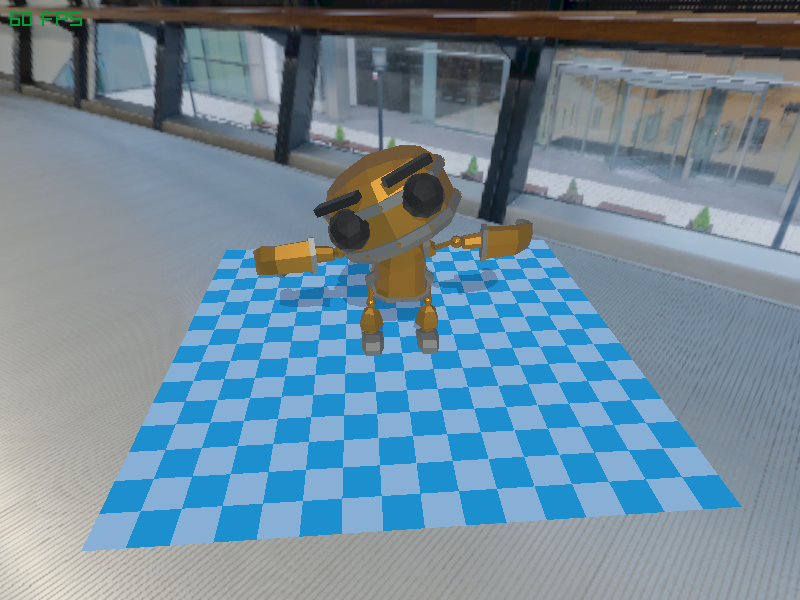
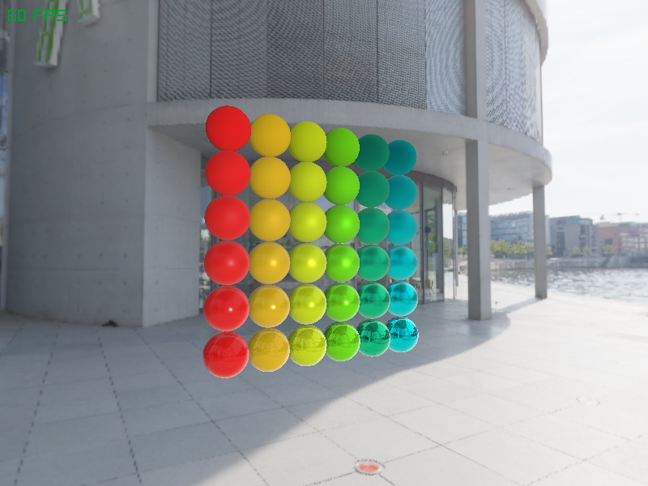
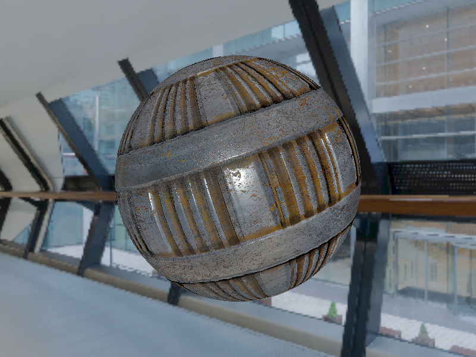
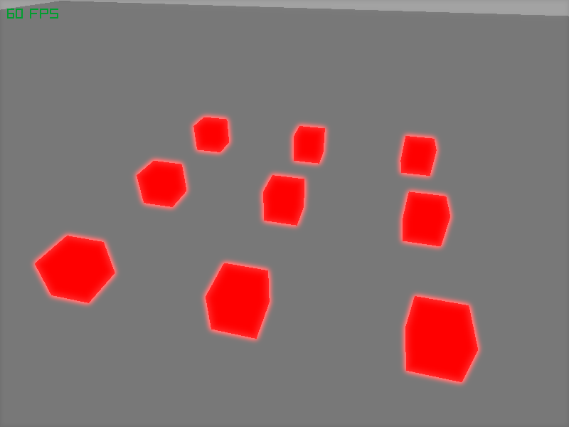

# R3D - 3D Rendering Library for raylib

R3D is a 3D rendering library designed to work with [raylib](https://www.raylib.com/). It offers features for lighting, shadows, materials, camera management, and more, optimized for real-time rendering applications.

This library is suitable for developers who want to integrate 3D rendering into their raylib projects without building a full rendering engine from scratch.

---

## Features

- **Material System**: Allows the creation of materials with multiple diffuse and specular rendering modes, including a toon shading mode. Features include IBL, normal maps, ambient occlusion, and more, as well as sorting surfaces by material to reduce state changes during rendering.
- **Lighting**: Support for multiple light types, including directional, point, and spotlights, with customizable properties.
- **Shadow Mapping**: Real-time shadow rendering with configurable resolution and support for different light types.
- **Post-processing Effects**: Easily integrate post-processing effects like bloom, tonemapping, etc.
- **Frustum Culling**: Optimized view frustum culling to only render objects within the camera’s view.
- **Blit Management**: Renders at a base resolution and blits the result (with applied post-processing effects), either maintaining the window aspect ratio or the internal resolution aspect ratio with an auto letterbox effect.

---

## Getting Started

To use R3D, you must have [raylib](https://www.raylib.com/) installed. Follow the steps below to get started with R3D in your project.

### Prerequisites

- **raylib**: The library is provided as a submodule but is **optional**. It is only required if you wish to build the examples that come with R3D.
- **CMake**: For building the library.
- **C++ Compiler**: A C++20 or higher compatible compiler.

### Installation

1. **Clone the repository**:

   ```bash
   git clone https://github.com/your-username/R3D.git
   cd R3D
   ```

2. **Optional: Clone raylib submodule** (only needed for building the examples):

   ```bash
   git submodule update --init --recursive
   ```

   **Note**: raylib is provided as a submodule but you can skip cloning it if you don't intend to build the examples.

3. **Build the library**:

   Use CMake to configure and build the library.

   ```bash
   mkdir build
   cd build
   cmake ..
   make
   ```

4. **Link the library to your project**:

   - R3D is a CMake project, and you can include it in your own CMake-based project via `add_subdirectory()` or by linking directly to the built library.
   - If you're using it as the main project, you can build the examples using the option `R3D_BUILD_EXAMPLES` in CMake.

---

## Usage

### Initialize R3D

First, initialize the R3D renderer with the appropriate resolution and settings. The `R3D_Init()` function initializes everything needed for rendering.

```c
#include <r3d.h>

int main() {
    // Initialize raylib window
    InitWindow(800, 600, "R3D Example");

    // Initialize R3D Renderer
    R3D_Init();

    // Load a model to render
    R3D_Model model = R3D_LoadModelFromMesh(GenMeshCube(1.0f, 1.0f, 1.0f));

    // Create a directional light
    R3D_Light light = R3D_CreateLight(R3D_DIRLIGHT, 0);
    R3D_SetLightPosition(light, (Vector3) { 0, 5, 0 });

    // Init a Camera3D
    Camera3D camera = {
        .position = (Vector3) { 0, 0, 5 },
        .target = (Vector3) { 0, 0, 0 },
        .up = (Vector3) { 0, 1, 0 },
        .fovy = 60.0f,
        .projection = CAMERA_PERSPECTIVE
    };

    // Main rendering loop
    while (!WindowShouldClose()) {
        BeginDrawing();
            R3D_Begin(camera);
                R3D_Draw(&model);
            R3D_End();
        EndDrawing();
    }

    // Close R3D renderer and raylib
    R3D_Close();
    CloseWindow();

    return 0;
}
```

### Adding Lights

R3D supports several types of lights, including point, spot, and directional lights. You can create and manage lights like so:

```c
R3D_Light light = R3D_CreateLight(R3D_SPOTLIGHT, 0);                    // Adds a spot light
R3D_SetLightPositionTarget(light, (Vector3){0, 10, 0}, (Vector3){0});   // Set light position and target
```

### Drawing a Model

To draw a model in the scene, use the `draw()` method. It accepts various transformation parameters such as position, rotation axis, rotation angle, and scale.

```c
R3D_Model model = R3D_LoadModel("model.obj");
R3D_DrawPro(&model, (Vector3){0, 0, 0}, (Vector3){0, 1, 0}, 45.0f, (Vector3){1, 1, 1});
```

---

## Additional Notes

- **Shadow Mapping**: Supports shadows for point, spot, and directional lights. When creating a light, you can specify a shadow map resolution to enable shadow casting, or set it to `0` to disable shadows. Shadows can still be enabled later using the `R3D_EnableLightShadow` function:

```c
R3D_EnableLightShadow(light, 2048);  // Enable shadow mapping with a 2048x2048 shadow map resolution
```

- **Material System**: The material system allows you to configure shaders and material properties for your models. Use the `R3D_CreateMaterialConfig` function to load a material configuration:

```c
R3D_MaterialConfig config = R3D_CreateMaterialConfig(
    R3D_DIFFUSE_BURLEY, R3D_SPECULAR_SCHLICK_GGX,
    R3D_BLEND_ALPHA, R3D_CULL_BACK,
    R3D_MATERIAL_FLAG_MAP_NORMAL |
    R3D_MATERIAL_FLAG_MAP_AO
);

R3D_SetMaterialConfig(&model, surfaceIndex, config);
```

- **Post-processing**: Post-processing effects like bloom, tonemapping or color correction can be added at the end of the rendering pipeline using R3D's built-in shaders.

---

## Contributing

If you'd like to contribute, feel free to open an issue or submit a pull request.

---

## License

This project is licensed under the **Zlib License** - see the [LICENSE](LICENSE) file for details.

---

## Acknowledgements

Thanks to [raylib](https://www.raylib.com/) for providing an easy-to-use framework for 3D development!

## Screenshots





